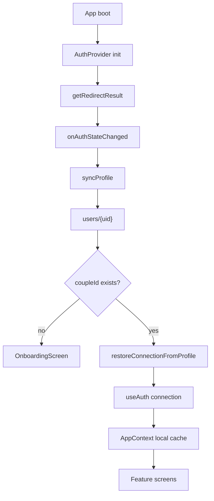
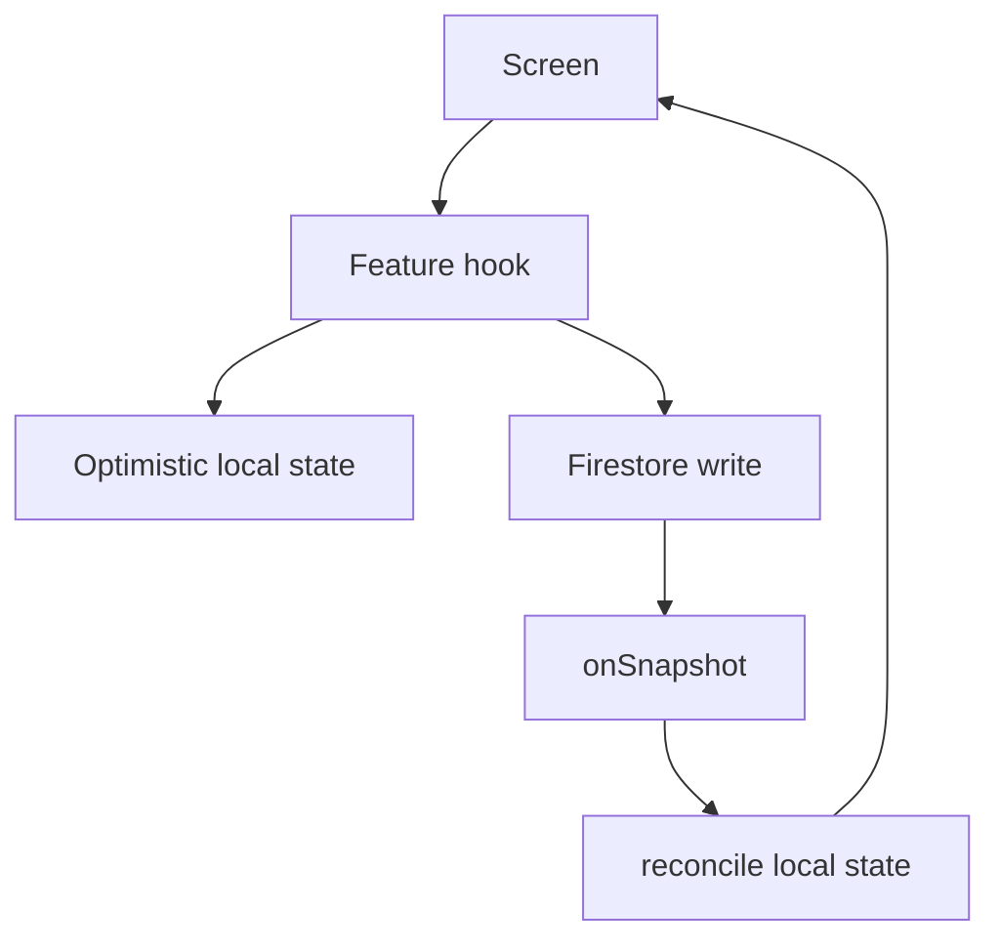

# Tether 전체 소스 리뷰 및 수정 방향

작성일: 2026-06-09  
범위: `src`, `functions`, Firebase rules, PWA/FCM 설정, 주요 화면/훅  
목적: 현재 개발 상태가 불안정한 원인을 구조적으로 정리하고, 이후 수정 작업을 안전한 순서로 진행하기 위한 핸드오프 문서

## 01. 요약

Tether의 반복 버그는 단일 기능 문제라기보다 **상태의 원천이 여러 곳에 나뉘어 있는 구조**에서 주로 발생한다.

가장 큰 축은 다음과 같다.

- 인증/연결 상태가 `Firebase Auth`, `users/{uid}.coupleId`, `useAuth`, `useCoupleSession`, `AppContext/localStorage`에 분산되어 있다.
- 읽음/뱃지 상태가 `lastRead`, `readBy`, `isRead`를 혼용한다.
- Firestore rules가 일부 화면의 의도보다 넓게 열려 있어 UI 버그가 데이터 무결성 문제로 이어질 수 있다.
- PWA/FCM 알림은 foreground/background, Android/iOS, 설치 여부에 따라 동작 경로가 달라 별도 테스트 매트릭스가 필요하다.
- UI 스타일이 CSS 변수와 Tailwind 하드코딩 색상 사이에 섞여 있어 고대비, 줄바꿈, 터치 타겟이 일관되지 않다.

즉시 우선순위는 다음 순서가 적절하다.

1. **Session Source of Truth 통합**
2. **Read/Badge 모델 정리**
3. **Firestore rules 및 ownership 강화**
4. **Optimistic sync와 clientId 기반 reconciliation 개선**
5. **PWA/알림/UI 접근성 안정화**

## 02. 현재 구조 진단

### 인증/세션 흐름



현재 연결 상태는 서버와 클라이언트 양쪽에 중복 저장된다.

- 서버: `users/{uid}.coupleId`, `couples/{coupleId}.members`
- 클라이언트: `useAuth.coupleId`, `useAuth.connection`, `useCoupleSession`, `AppContext`, `localStorage`

이 구조에서는 한쪽 복원이 실패하거나 늦게 도착하면 화면 라우팅과 데이터 구독이 서로 다른 상태를 볼 수 있다.

### 데이터 동기화 흐름



채팅, 일기, 콘텐츠, 사진, 히스토리 훅은 모두 비슷하지만 실패 처리와 optimistic rollback 방식이 다르다. 일부 훅은 실패해도 UI가 성공 상태처럼 남는다.

### 알림 흐름

```mermaid
flowchart TD
  write[Firestore write] --> function[Cloud Function trigger]
  function --> fcm[FCM]
  fcm --> foreground[Foreground onMessage]
  fcm --> sw[Service Worker background]
  foreground --> toast[In-app toast]
  foreground --> sound[Web Audio sound]
  foreground --> systemNotification[System notification]
  sw --> backgroundNotification[showNotification]
  backgroundNotification --> click[notificationclick]
  click --> url["/?screen=chat"]
  url --> appScreen[React screen state]
```

React 화면 상태는 URL 라우터가 아니라 내부 state이므로, 알림 클릭으로 `/?screen=chat`이 열려도 이미 앱이 열린 상태에서는 화면 전환이 누락될 수 있다.

## 03. Critical 이슈

### C1. 연결 상태의 원천이 분산되어 복원 실패와 stale 상태가 반복됨

**영향 파일**

- `src/hooks/useAuth.tsx`
- `src/hooks/useCoupleSession.ts`
- `src/context/AppContext.tsx`
- `src/App.tsx`
- `src/lib/coupleAuth.ts`

**원인**

`useAuth`는 인증 상태와 `coupleId`를 관리하고, `useCoupleSession`은 다시 `users/{uid}`를 구독한다. `AppContext`는 별도로 `localStorage`에 uid, coupleId, partnerUid, 닉네임을 저장한다.

이 때문에 다음 상태가 동시에 존재할 수 있다.

- Auth에는 `coupleId`가 있음
- `restoreConnectionFromProfile()`은 실패함
- `AppContext`에는 예전 partnerUid가 남아 있음
- 화면은 `coupleId !== null` 기준으로 홈/잠금 화면을 보여줌

**수정 방향**

- `CoupleSessionProvider`를 신설하거나 기존 `useAuth`를 확장해 **단일 세션 모델**을 만든다.
- 라우팅 기준을 `coupleId` 단독이 아니라 `connection != null` 또는 `session.status === 'connected'`로 바꾼다.
- 복원 실패는 `coupleId = null`로 덮지 말고 `restore_failed` 상태로 분리한다.
- async restore에는 generation token을 둬 늦게 끝난 요청이 최신 상태를 덮지 못하게 한다.

**검증**

- 기존 Google 계정으로 새 Android 기기 로그인
- `users.coupleId`는 있는데 `couples` 읽기 실패하는 상황
- 오프라인 부팅 후 온라인 복귀
- 다른 계정으로 재로그인

### C2. 연결 해제가 로컬 전용이라 실제 서버 연결이 유지됨

**영향 파일**

- `src/screens/SettingsScreen.tsx`
- `src/context/AppContext.tsx`
- `functions/src/index.ts`
- `firestore.rules`

**원인**

설정 화면의 연결 해제는 `AppContext`와 `localStorage`만 비운다. 서버의 `users/{uid}.coupleId`, `couples/{coupleId}`는 그대로 유지된다.

**영향**

- 새로고침하면 다시 연결이 복원된다.
- 사용자 입장에서는 연결이 끊긴 줄 알지만 실제 서버 상태는 유지된다.
- 이후 invite, 알림, 데이터 접근 상태가 혼란스러워진다.

**수정 방향**

- `disconnectCouple` callable Cloud Function을 추가한다.
- 서버에서 양쪽 `users/{uid}.coupleId`를 정리하거나 couple 문서를 archive 상태로 전환한다.
- 클라이언트는 서버 처리 성공 후 local cache를 비운다.
- 서버 기능 전까지 UI 문구는 “이 기기의 로컬 연결 정보 초기화”로 낮춰야 한다.

### C3. `users/{uid}` rules가 너무 넓음

**영향 파일**

- `firestore.rules`
- `src/lib/coupleAuth.ts`
- `src/hooks/usePushNotification.ts`
- `src/context/UnreadBadgesContext.tsx`

**원인**

현재 `users/{uid}`는 인증된 사용자라면 누구나 read 가능하고, 본인은 거의 모든 필드를 update 가능하다.

문제 필드 예시:

- `coupleId`
- `fcmToken`
- `notificationSettings`
- `lastRead`
- `nickname`

**영향**

- 클라이언트에서 `coupleId`를 임의로 쓰면 복원 루프와 stale 상태가 생긴다.
- 다른 로그인 사용자가 타인의 FCM token 등 민감 필드에 접근할 수 있다.

**수정 방향**

- `users/{uid}` read를 self + couple partner로 제한한다.
- `coupleId`는 클라이언트 update 금지, Cloud Function만 수정하게 한다.
- `lastRead`, `notificationSettings`, `fcmToken`, `nickname`은 허용 필드를 명시한다.
- 공개 프로필이 필요하면 `publicProfiles/{uid}`로 분리한다.

### C4. 읽음/뱃지 모델이 서로 다름

**영향 파일**

- `src/context/UnreadBadgesContext.tsx`
- `src/screens/ChatScreen.tsx`
- `src/screens/DiaryScreen.tsx`
- `src/components/BottomNav.tsx`
- `firestore.rules`

**현재 모델**

| 영역 | 현재 배지 기준 | 실제 읽음 기준 | 문제 |
|---|---|---|---|
| Chat | `lastRead.chat` | `readBy` | 두 상태가 어긋날 수 있음 |
| Diary | `isRead` | `isRead` | `lastRead.diary`는 사실상 의미 없음 |
| Contents | `lastRead.more` | 없음 | Settings 진입과 Contents 확인이 섞임 |

**수정 방향**

- Chat: `readBy` 또는 `lastRead.chat` 중 하나를 배지 기준으로 정한다. 권장: 소규모 커플 앱은 `readBy`가 직관적이다.
- Diary: `isRead` 유지. `lastRead.diary` 제거 또는 사용처 명확화.
- Contents: `more`가 아니라 `contents`로 명명하고, Settings 진입으로 badge가 사라지지 않게 한다.
- `markAsRead`는 batch 또는 debounce로 묶는다.

## 04. High 이슈

### H1. 화면 remount로 데이터 훅 상태가 자주 초기화됨

화면 전환 시 screen tree가 재생성되면 채팅 pagination, optimistic pending map, listener가 모두 리셋될 수 있다.

**수정 방향**

- 장기 상태가 필요한 hook은 화면 내부가 아니라 provider 레이어로 올린다.
- 특히 `useChat`, `useDiary`, `UnreadBadgesProvider`는 `coupleId` 기준으로 유지한다.

### H2. optimistic update 실패 시 rollback이 일관되지 않음

**문제 패턴**

- `useChat`: 일부 rollback 존재
- `useDiary.markDiaryRead`: 실패해도 읽음으로 남을 수 있음
- `useContents.updateStatus`: 실패해도 상태 변경처럼 보일 수 있음
- `useAnniversaries`: 실패 처리 약함

**수정 방향**

- `syncHelpers.ts`에 공통 optimistic helper를 확장한다.
- 모든 optimistic write는 `apply → server write → confirm/revert` 형태로 통일한다.
- 사용자에게 실패 toast를 보여준다.

### H3. pending reconciliation이 시간/제목/본문 기반이라 충돌 가능

현재 optimistic row와 서버 row를 맞출 때 시간차와 제목/본문을 추정해서 병합한다. 같은 문장을 짧은 시간에 두 번 보내면 잘못 병합될 수 있다.

**수정 방향**

- 모든 쓰기 요청에 `clientId`를 추가한다.
- optimistic row와 서버 row는 `clientId`로 정확히 매칭한다.
- 기존 문서에는 clientId가 없을 수 있으므로 fallback 로직은 일정 기간 유지한다.

### H4. 알림 foreground/background 경로가 과하게 겹침

최근 수정으로 foreground에서 소리, 시스템 알림, toast가 동시에 발생할 수 있다.

**수정 방향**

- 앱이 visible이면 toast + 선택적 소리만 사용한다.
- 앱이 hidden/minimized이면 시스템 알림을 사용한다.
- Service Worker는 이미 client가 focus 상태이면 시스템 notification을 띄우지 않고 postMessage만 보낸다.

### H5. Android/iOS PWA 조건이 다름

iOS는 설치된 PWA에서만 Web Push가 안정적으로 동작한다. Android는 Chrome/PWA/인앱 브라우저에 따라 OAuth와 push 동작이 다르다.

**수정 방향**

- iOS + not standalone에서는 push permission 요청 전에 설치 안내를 먼저 보여준다.
- Android는 Chrome/PWA 기준으로 테스트하고, 인앱 브라우저는 Google login/Push 지원 범위 밖으로 명시한다.

## 05. Medium 이슈

### M1. Settings의 알림 설정이 localStorage와 Firestore로 나뉨

Cloud Functions는 Firestore `notificationSettings`를 보고, foreground UI는 localStorage를 읽는다.

**수정 방향**

- Firestore를 source of truth로 한다.
- localStorage는 오프라인 캐시로만 사용한다.
- `users/{uid}` snapshot에서 settings를 hydrate한다.

### M2. profile fields가 localStorage에만 남는 항목이 있음

닉네임, partnerNickname, firstMet 등이 화면마다 localStorage와 Firestore 사이에서 어긋날 수 있다.

**수정 방향**

- 사용자 프로필: `users/{uid}`
- 커플 공통 설정: `couples/{coupleId}`
- 화면 상태 캐시: localStorage

이렇게 책임을 분리한다.

### M3. Invite lifecycle이 약함

초대 코드는 여러 개 발급될 수 있고, 만료/폐기 모델이 약하다.

**수정 방향**

- 사용자당 활성 invite 1개
- `expiresAt`, `revokedAt` 추가
- 재발급 시 이전 invite 폐기
- 코드 생성은 Cloud Function으로 이동

### M4. Chat read write가 N개 메시지마다 발생

채팅 화면 진입 시 읽지 않은 메시지마다 `updateDoc`이 발생한다.

**수정 방향**

- pending read set으로 중복 방지
- `writeBatch` 또는 일정 시간 debounce
- 메시지가 많을 때 read receipt는 마지막 read marker 기반으로 단순화 검토

## 06. Low 이슈

- 고대비 테마가 Tailwind 하드코딩 색상 전체를 덮지 못한다.
- 일부 텍스트가 접근성 기준 16px보다 작다.
- 하단 nav, 이미지 버튼, 전송 버튼 일부 터치 타겟이 50px 미만이다.
- `Active now`가 실제 presence가 아닌 정적 문구다.
- Toast 컴포넌트에 nested button 구조가 있어 접근성/HTML 측면에서 좋지 않다.
- iOS safe-area가 Chat/Header/BottomNav에 일관되게 반영되지 않는다.

## 07. PR 단위 수정 로드맵

### PR 1. Session Source of Truth 통합

**목표**

연결 복원, 라우팅, 데이터 구독이 같은 세션 상태를 바라보게 만든다.

**작업**

- `CoupleSessionProvider` 또는 `SessionProvider` 신설
- `useAuth`, `useCoupleSession`, `AppContext` 역할 정리
- `session.status`: `loading | signed_out | no_couple | restoring | connected | restore_failed`
- `connection` 없는 `coupleId`로 홈/잠금 진입 금지
- restore generation token 적용

**검증**

- PC 가입 계정 Android 로그인
- 오프라인 부팅 후 온라인 복귀
- 유효하지 않은 `coupleId` 상태
- 계정 전환

### PR 2. Read/Badge 모델 정리

**목표**

확인해도 사라지지 않거나, 보지 않았는데 사라지는 badge 문제를 끝낸다.

**작업**

- Chat 기준 결정: `readBy` 또는 `lastRead.chat`
- Diary는 `isRead` 기준으로 고정
- Contents badge를 `more`에서 `contents`로 분리
- Settings 진입으로 contents badge가 사라지지 않게 수정
- `markAsRead` batch/debounce

**검증**

- 상대 메시지 50개 수신 후 채팅 진입
- 상대 일기 목록만 보기 vs 카드 열기
- 콘텐츠 새 항목 수신 후 Settings 진입
- 다중 기기에서 배지 동기화

### PR 3. Firestore rules 및 ownership 강화

**목표**

클라이언트 실수나 악성 수정이 서버 데이터 무결성을 깨지 못하게 한다.

**작업**

- `users/{uid}` read scope 제한
- 클라이언트 `coupleId` update 금지
- `messages` update 필드 제한
- `contents`, `photos`, `history` ownership 규칙 통일
- rules emulator 테스트 추가

**검증**

- 파트너 콘텐츠 수정/삭제 거부
- 본인 콘텐츠 수정/삭제 허용
- partner read receipt만 허용
- 임의 `users/{uid}.coupleId` 수정 거부

### PR 4. Optimistic sync와 clientId reconciliation

**목표**

중복 표시, 실패 후 UI 불일치, 잘못된 optimistic 병합을 줄인다.

**작업**

- `clientId` 생성 유틸 추가
- chat/diary/content/photo/history 쓰기에 `clientId` 저장
- `syncHelpers`를 `clientId` 우선 매칭으로 변경
- 모든 optimistic update에 rollback/toast 적용
- `serverTimestamp()` 사용 표준화

**검증**

- 같은 문장 연속 전송
- 이미지 연속 전송
- 오프라인 상태에서 쓰기 실패
- 서버 snapshot 도착 후 중복 bubble 여부

### PR 5. PWA/알림/UI 접근성 안정화

**목표**

Android/iOS PWA, 알림, 고대비, 줄바꿈, safe-area를 안정화한다.

**작업**

- URL/SW deep link를 React 화면 state와 연결
- foreground 알림 중복 제거
- iOS standalone 전 push permission gate
- `useFontScale` App bootstrap
- Chat/Home/BottomNav safe-area 보강
- 고대비 하드코딩 색상 정리
- 터치 타겟 50px 기준 적용

**검증**

- Android PWA background push
- 앱 visible 상태 foreground push
- iOS Safari vs iOS installed PWA
- 고대비 채팅/홈/설정
- 긴 한국어/URL/이모지 메시지 줄바꿈

## 08. 검증 계획

### 자동 테스트

| 테스트 | 목적 |
|---|---|
| Firebase rules unit test | ownership, users read/update, read receipt 허용 검증 |
| `scripts/test-e2e-firebase.ts` 확장 | invite claim, forced pairing, diary read, badge clearing 검증 |
| sync helper unit test | optimistic reconciliation, clientId matching 검증 |
| auth/session unit test | restore success/failure state machine 검증 |

### 실기기 QA

**Android Chrome/PWA**

- Google 기존 계정 로그인
- PWA 설치 후 push token 저장
- background 알림 수신
- foreground 알림 소리/토스트 동작
- 긴 채팅 줄바꿈

**iOS Safari/PWA**

- Safari tab에서는 push permission 요청 대신 설치 안내
- Home Screen PWA에서 permission 요청
- foreground/background 알림
- safe-area, keyboard, bottom input 확인

**PC Chrome**

- PC 720px layout
- Android와 같은 Google 계정 데이터 복원
- 채팅/일기/콘텐츠 양방향 동기화

### 수동 회귀 체크리스트

- [ ] PC에서 가입한 Google 계정으로 Android 로그인 시 같은 couple data 복원
- [ ] 익명 시작 후 Google 연결 시 uid/couple 유지
- [ ] 상대 일기 읽기 후 diary badge 제거
- [ ] 상대 채팅 읽기 후 chat badge 제거 및 read receipt 표시
- [ ] Settings 진입으로 contents badge가 사라지지 않음
- [ ] 본인 메시지 긴 문장/줄바꿈 자연스러움
- [ ] 고대비에서 내 채팅 글자 명확히 보임
- [ ] 알림 허용 후 Android PWA에서 실제 시스템 알림 도착
- [ ] 앱 열린 상태에서 알림 중복 발생하지 않음
- [ ] 연결 해제 후 새로고침 시 서버 상태와 UI가 일치

## 09. Cursor 구현 지시문

### 1차 구현 권장 범위

가장 먼저 처리할 작업은 **Session Source of Truth 통합**이다.

이유:

- 로그인/복원/연결/화면 라우팅이 모든 기능의 기반이다.
- 현재 발생한 Android 로그인, 데이터 복원, stale 화면, 연결 상태 꼬임이 모두 이 레이어와 관련 있다.
- 이 레이어가 정리되지 않으면 badge, 알림, 데이터 훅을 고쳐도 다른 경로에서 재발할 수 있다.

Cursor 작업 시 주의:

- 기존 사용자 데이터를 마이그레이션 없이 잃지 않아야 한다.
- 익명 계정과 Google 계정 연결 경로를 명확히 분리해야 한다.
- `users/{uid}.coupleId`를 임의로 null 처리하지 말고 실패 상태를 별도로 보여줘야 한다.
- 로컬 캐시 삭제는 서버 상태 변경과 분리해서 다뤄야 한다.

### 2차 구현 권장 범위

**Read/Badge 모델 정리 + Firestore rules 보강**을 함께 처리한다.

이유:

- badge UI는 rules의 read/update 허용과 직접 연결된다.
- rules만 바꾸면 현재 클라이언트가 실패할 수 있고, 클라이언트만 바꾸면 서버 무결성이 약하다.

### 3차 구현 권장 범위

**Optimistic sync와 PWA/알림/UI 안정화**를 분리해서 처리한다.

이유:

- optimistic sync는 데이터 모델 변경을 수반한다.
- PWA/알림/UI는 실기기 QA가 필수라 별도 배포/검증 사이클이 필요하다.

## 10. Codex 재검증 포인트

Codex는 구현 후 다음 항목을 중점 검증한다.

1. 세션 상태 머신이 `connected`와 `restore_failed`를 명확히 분리하는지
2. `users/{uid}.coupleId`가 클라이언트에서 임의 수정 불가능한지
3. `disconnectCouple`이 양쪽 사용자와 couple 문서를 일관되게 처리하는지
4. Chat/Diary/Contents badge 기준이 문서와 코드에서 일치하는지
5. optimistic write 실패 시 UI rollback이 되는지
6. Android/iOS PWA 알림 테스트가 foreground/background로 분리되어 있는지
7. 고대비와 접근성 기준이 주요 화면에 적용되었는지

## 11. 권장 작업 순서 요약

| 순서 | 작업 | 위험도 | 기대 효과 |
|---|---|---:|---|
| 1 | Session Source of Truth 통합 | 높음 | 로그인/복원/라우팅 안정화 |
| 2 | Read/Badge 모델 정리 | 중간 | 뱃지/읽음 상태 반복 버그 제거 |
| 3 | Firestore rules 강화 | 높음 | 데이터 무결성/보안 향상 |
| 4 | Optimistic sync 정리 | 중간 | 중복 표시/실패 후 stale UI 감소 |
| 5 | PWA/알림/UI 접근성 | 중간 | 실기기 UX 안정화 |

## 12. 결론

Tether의 현재 문제는 기능이 많아서 생긴 단순 버그 누적이 아니라, **핵심 상태 모델이 분산된 상태에서 기능이 빠르게 얹힌 결과**에 가깝다.

따라서 단발 수정으로 계속 막는 방식보다, 먼저 세션과 읽음 모델을 통합하고 Firestore rules를 그 모델에 맞춰 좁히는 것이 장기적으로 안전하다.

가장 중요한 원칙은 다음이다.

- `Markdown`이나 문서가 아니라 앱에서는 **Firestore 서버 상태를 source of truth**로 둔다.
- `localStorage`는 캐시일 뿐 서버 연결 상태를 대체하지 않는다.
- 화면은 `coupleId` 문자열이 아니라 **복원된 connection/session**을 기준으로 렌더링한다.
- 읽음 상태는 기능별로 하나의 기준만 사용한다.
- 서버 rules가 UI의 의도를 최종적으로 보장해야 한다.

이 방향으로 정리하면 Android 로그인, 뱃지, 알림, 채팅 레이아웃 같은 자잘한 버그도 같은 뿌리에서 줄어들 가능성이 높다.
