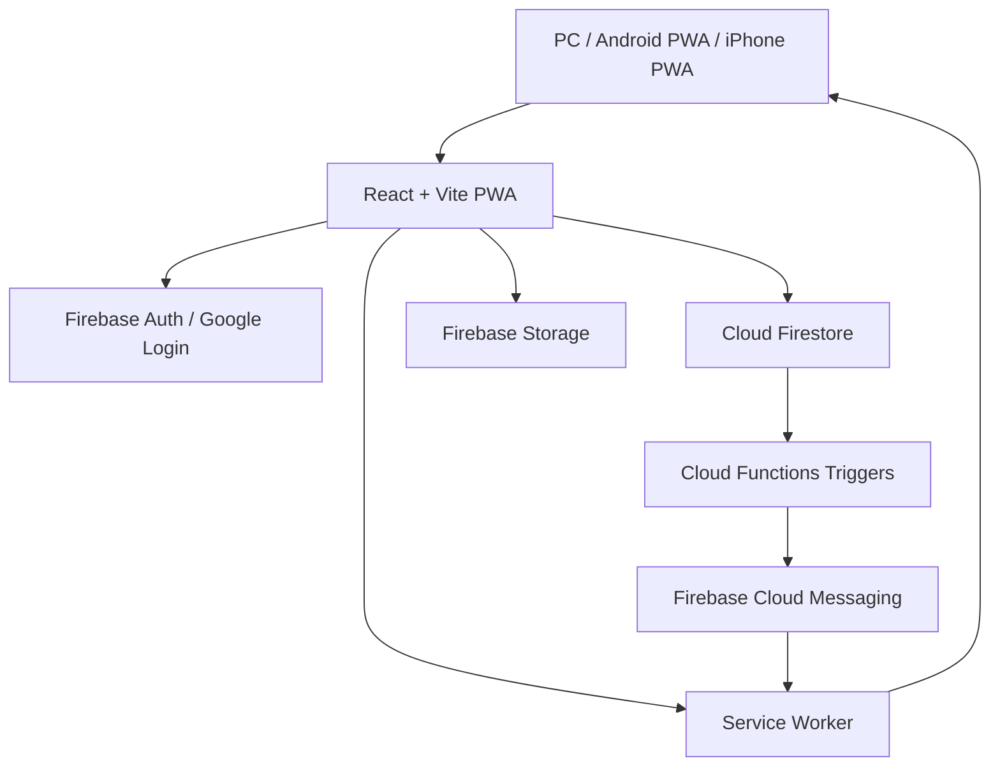

# Tether 아키텍처

작성일: 2026-06-28  
기준 버전: v0.5.10

## 01. 개요

Tether는 React/Vite 기반 PWA와 Firebase 백엔드로 구성된다. 클라이언트는 커플 단위 Firestore 문서를 실시간 구독하고, 파일/이미지는 Firebase Storage에 저장한다. 알림은 FCM, Service Worker, Cloud Functions가 함께 담당한다.

## 02. 구성도

## 03. 프론트엔드 레이어

주요 구조:

- `src/App.tsx`: 세션 기반 화면 라우팅, 전역 플레이어, 토스트
- `src/context/SessionContext.tsx`: 로그인/커플 연결/복구 Provider
- `src/context/useSession.ts`: 세션 hook
- `src/context/AppContext.tsx`: 앱 캐시와 연결 정보 Provider
- `src/context/useApp.ts`: 앱 context hook
- `src/context/UnreadBadgesContext.tsx`: 배지 계산 Provider
- `src/context/useUnreadBadges.ts`: 배지 hook
- `src/screens/*`: 화면 단위 UI
- `src/hooks/*`: Firestore 구독과 쓰기 로직
- `src/lib/*`: Firebase, 알림, 버전, sync helper

## 04. Firebase Auth

원칙:

- Google 로그인만 허용
- 익명/비회원 가입 차단
- 관리자 이메일은 `kuroicode@gmail.com`
- 승인 전 사용자는 승인 대기 화면으로 이동

## 05. Firestore

핵심 컬렉션:

- `users/{uid}`
- `publicProfiles/{uid}`
- `couples/{coupleId}`
- `couples/{coupleId}/messages`
- `couples/{coupleId}/files`
- `couples/{coupleId}/diary`
- `couples/{coupleId}/photos`
- `couples/{coupleId}/contents`
- `couples/{coupleId}/links`
- `couples/{coupleId}/dateRecipes`
- `couples/{coupleId}/feedbackReports`

중요 설계:

- 세션 source of truth는 `users/{uid}`
- 커플 데이터 접근은 couple member 검증 기반
- 파일 자료실은 `messages`가 아니라 `files` 인덱스를 안정 소스로 사용
- 같이듣기는 `couples/{coupleId}`의 `selections`, `excludedBy` 필드로 동기화

## 06. Storage

주요 경로:

- `couples/{coupleId}/images/{uid}/...`
- `couples/{coupleId}/files/{uid}/...`
- `couples/{coupleId}/photos/{uid}/...`
- `couples/{coupleId}/contents/{uid}/...`
- `couples/{coupleId}/links/{uid}/...`

원칙:

- 커플 멤버 read
- 업로더 write/delete
- 민감 경로 하드코딩 금지

## 07. Cloud Functions

주요 역할:

- 커플 초대/연결
- 상태 변경 알림
- 채팅 메시지 알림
- 일기/댓글 알림
- 푸시 토큰 정리
- 테스트 알림

알림 발송은 멀티 디바이스 토큰을 대상으로 multicast 처리한다.

## 08. PWA / Service Worker

Service Worker:

- `public/firebase-messaging-sw.js`
- 백그라운드 FCM 수신
- notification click deep link
- 앱 창 visible 여부에 따라 시스템 알림/내부 알림 분기

현재 알림 정책:

- 앱 창 visible: 내부 toast + sound
- 앱 hidden/minimized: system notification
- 알림 클릭: 앱 focus + screen navigation

## 09. 접근성 아키텍처

전역 기준:

- 고대비/다크 모드 기본 지원
- `hc-readable-box` 패턴
- 50px 터치 타겟
- 선택 상태는 반전/아이콘/보더로 표현
- 상태 메시지와 태그는 저시력 기준 우선

## 10. 운영 원칙

- 검증보고서와 완료보고서는 Notion이 아니라 `docs/` Markdown에 저장
- 릴리즈/핫픽스는 앱 Log에 기록
- 배포 전 `npm run lint`, `npm run build`, Functions build 확인
- Rules 변경 시 dry-run 후 실제 배포
- 운영 데이터 백필은 별도 검증보고서로 남김
- Google-only live E2E는 Admin SDK seed로 테스트 데이터를 만들고 custom token으로 클라이언트 권한을 검증한다.
